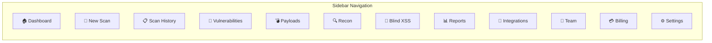
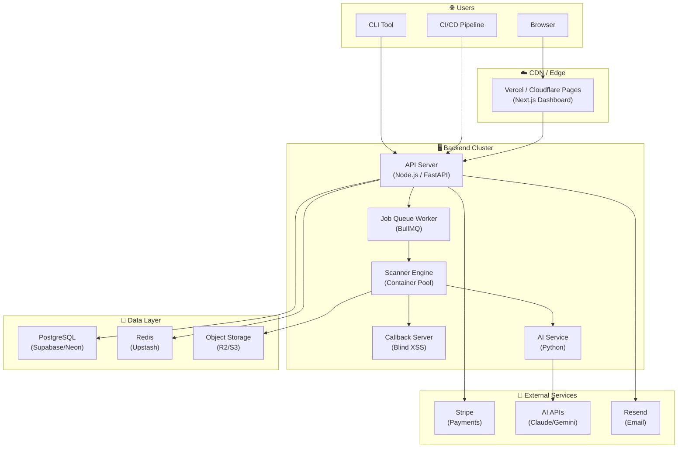

```mermaid
graph TB
    subgraph PUBLIC["🌐 Public"]
        LANDING["Landing Page\n(marketing)"]
        PRICING["Pricing Page"]
        DOCS["API Docs"]
    end

    subgraph AUTH["🔐 Auth Layer"]
        LOGIN["Login / Register"]
        OAUTH["OAuth (Google, GitHub)"]
        SUB["Subscription Check"]
    end

    subgraph DASHBOARD["📊 Dashboard (Next.js)"]
        OVERVIEW["Overview / Home"]
        SCANNER["Scan Launcher"]
        LIVE["Live Scan View"]
        RESULTS["Results & Vulns"]
        PAYLOADS_UI["Payload Library"]
        RECON_UI["Recon Module"]
        REPORTS_UI["Reports"]
        BLIND_UI["Blind XSS Monitor"]
        SETTINGS["Settings"]
        BILLING["Billing / Plans"]
        TEAM["Team Management"]
    end

    subgraph API["⚙️ Backend API"]
        REST["REST API\n(FastAPI / Node.js)"]
        WS_API["WebSocket\n(Real-time scan updates)"]
        QUEUE["Job Queue\n(Bull / Celery)"]
    end

    subgraph ENGINE["🔬 Scan Engine"]
        CORE_E["Core Scanner\n(dari v3)"]
        SANDBOX_E["Browser Sandbox"]
        AI_E["AI Engine"]
        PAYLOAD_E["Payload Library"]
    end

    subgraph DATA["💾 Data Layer"]
        PG["PostgreSQL\n(users, scans, results)"]
        REDIS["Redis\n(cache, queue, sessions)"]
        S3["Object Storage\n(screenshots, reports, HAR)"]
    end

    PUBLIC --> AUTH
    AUTH --> DASHBOARD
    DASHBOARD --> API
    API --> ENGINE
    API --> DATA
    ENGINE --> DATA

    style PUBLIC fill:#1a365d,color:#fff
    style AUTH fill:#742a2a,color:#fff
    style DASHBOARD fill:#22543d,color:#fff
    style API fill:#744210,color:#fff
    style ENGINE fill:#553c9a,color:#fff
    style DATA fill:#1a202c,color:#fff
```

# 🚀 XSS Scanner Sandbox — Blueprint v4: SaaS Platform

> Upgrade dari CLI Tool → Full SaaS Platform dengan Dashboard & Subscription Model

---

## Product Vision

```
SEBELUM (v1-v3)                      SESUDAH (v4)
───────────────                      ────────────
CLI-only tool                   →    Web Dashboard + CLI
Single user                     →    Multi-user / Multi-tenant
Free / open-source              →    Freemium SaaS (Free + Paid tiers)
Local install                   →    Cloud-hosted + self-host option
Manual setup                    →    One-click scan dari browser
SQLite                          →    PostgreSQL + Redis
No auth                         →    Full auth + team management
```



---

## Subscription Tiers

Referensi model: **Penligent AI**, **Intruder.io**, **PortSwigger Burp Suite Pro**, **Detectify**

### Tier Comparison

```
┌──────────────┬──────────────┬──────────────┬──────────────┬──────────────┐
│              │   🆓 FREE    │  ⭐ STARTER  │  💎 PRO      │ 🏢 ENTERPRISE│
│              │   $0/mo      │  $29/mo      │  $99/mo      │  $299+/mo    │
├──────────────┼──────────────┼──────────────┼──────────────┼──────────────┤
│              │              │              │              │              │
│ SCANS        │              │              │              │              │
│ Scans/month  │ 5            │ 50           │ Unlimited    │ Unlimited    │
│ Concurrent   │ 1            │ 3            │ 10           │ Unlimited    │
│ Scan depth   │ Basic        │ Medium       │ Deep         │ Deep+Custom  │
│ Scan resume  │ ❌           │ ✅           │ ✅           │ ✅           │
│              │              │              │              │              │
│ PAYLOADS     │              │              │              │              │
│ Payload DB   │ 5,000        │ 25,000       │ All 100K+    │ All + Custom │
│ Custom add   │ 50           │ 500          │ Unlimited    │ Unlimited    │
│ Auto-update  │ Monthly      │ Weekly       │ Daily        │ Real-time    │
│ AI-generated │ ❌           │ 100/mo       │ Unlimited    │ Unlimited    │
│              │              │              │              │              │
│ AI ENGINE    │              │              │              │              │
│ AI Provider  │ Local only   │ Claude/AGY   │ Claude/AGY   │ Claude/AGY   │
│ AI credits   │ 0            │ 10K tokens   │ 100K tokens  │ Unlimited    │
│ Smart bypass │ ❌           │ Basic        │ Advanced     │ Advanced     │
│ Auto-PoC     │ ❌           │ ❌           │ ✅           │ ✅           │
│              │              │              │              │              │
│ ANALYSIS     │              │              │              │              │
│ Reflected    │ ✅           │ ✅           │ ✅           │ ✅           │
│ DOM-based    │ Basic        │ ✅           │ ✅ Deep      │ ✅ Deep      │
│ Stored/Blind │ ❌           │ ✅           │ ✅           │ ✅           │
│ Taint track  │ ❌           │ Basic        │ Full         │ Full         │
│ CSP bypass   │ ❌           │ ❌           │ ✅           │ ✅           │
│ mXSS detect  │ ❌           │ ❌           │ ✅           │ ✅           │
│ DOM clobber  │ ❌           │ ❌           │ ✅           │ ✅           │
│              │              │              │              │              │
│ NETWORK      │              │              │              │              │
│ Proxy chain  │ ❌           │ 1 proxy      │ Multi-chain  │ Multi-chain  │
│ UA rotation  │ ❌           │ ✅           │ ✅           │ ✅           │
│ Stealth mode │ ❌           │ ❌           │ ✅           │ ✅           │
│ Tor support  │ ❌           │ ❌           │ ✅           │ ✅           │
│              │              │              │              │              │
│ EXFIL/POSTEX │              │              │              │              │
│ Cookie steal │ ❌           │ ✅           │ ✅           │ ✅           │
│ Callback srv │ ❌           │ Shared       │ Dedicated    │ Custom domain│
│ Webhook      │ ❌           │ 1 channel    │ Multi        │ Unlimited    │
│ Post-exploit │ ❌           │ ❌           │ ✅           │ ✅           │
│              │              │              │              │              │
│ REPORTING    │              │              │              │              │
│ Basic report │ ✅           │ ✅           │ ✅           │ ✅           │
│ PDF export   │ ❌           │ ✅           │ ✅           │ ✅           │
│ SARIF/JUnit  │ ❌           │ ❌           │ ✅           │ ✅           │
│ Bug bounty   │ ❌           │ ❌           │ ✅           │ ✅           │
│ Custom brand │ ❌           │ ❌           │ ❌           │ ✅           │
│              │              │              │              │              │
│ PLATFORM     │              │              │              │              │
│ Dashboard    │ ✅           │ ✅           │ ✅           │ ✅           │
│ CLI access   │ ✅           │ ✅           │ ✅           │ ✅           │
│ API access   │ ❌           │ Basic        │ Full         │ Full         │
│ Team members │ 1            │ 1            │ 5            │ Unlimited    │
│ Scan history │ 7 days       │ 30 days      │ 1 year       │ Unlimited    │
│ CI/CD integ  │ ❌           │ ❌           │ ✅           │ ✅           │
│ SSO/SAML     │ ❌           │ ❌           │ ❌           │ ✅           │
│ Priority sup │ ❌           │ Email        │ Chat         │ Dedicated    │
│ Self-host    │ ❌           │ ❌           │ ❌           │ ✅           │
│              │              │              │              │              │
│ RECON        │              │              │              │              │
│ WAF detect   │ ❌           │ ✅           │ ✅           │ ✅           │
│ Param mining │ ❌           │ ❌           │ ✅           │ ✅           │
│ JS analysis  │ ❌           │ Basic        │ Full         │ Full         │
│ Wayback mine │ ❌           │ ❌           │ ✅           │ ✅           │
│ Tech detect  │ ❌           │ ✅           │ ✅           │ ✅           │
│              │              │              │              │              │
└──────────────┴──────────────┴──────────────┴──────────────┴──────────────┘
```

### Revenue Projection

```
Free users (funnel)        → 1000 users   × $0    = $0       (awareness)
Starter (bug bounty hunter)→ 200 users    × $29   = $5,800/mo
Pro (pentester/team)       → 50 users     × $99   = $4,950/mo
Enterprise (company)       → 10 orgs      × $299  = $2,990/mo
─────────────────────────────────────────────────────────────
Projected MRR (Month 6):                    ~$13,740/mo
Projected ARR:                              ~$164,880/year
```

---

## Dashboard Pages Design

### 12 Halaman Utama



#### Page ① — Dashboard Overview

```
┌─────────────────────────────────────────────────────────────────┐
│  🛡️ XSS Scanner Sandbox                    [John Doe ▾] [PRO] │
├────────┬────────────────────────────────────────────────────────┤
│        │                                                        │
│ 🏠 Home│  Welcome back, John           [+ New Scan]            │
│        │                                                        │
│ 🎯 Scan│  ┌──────────┐ ┌──────────┐ ┌──────────┐ ┌──────────┐ │
│        │  │ 🔴 12    │ │ 🟡 34    │ │ 🟢 156   │ │ 📊 23    │ │
│ 📋 Hist│  │ Critical │ │ High     │ │ Medium   │ │ Scans    │ │
│        │  └──────────┘ └──────────┘ └──────────┘ └──────────┘ │
│ 🔴 Vuln│                                                       │
│        │  ┌─────────────────────────────────────────────────┐  │
│ 💣 Pay │  │  RECENT SCANS                                   │  │
│        │  │  ┌───┬──────────────┬────────┬────────┬───────┐ │  │
│ 🔍 Rec │  │  │ # │ Target       │ Status │ Vulns  │ Time  │ │  │
│        │  │  ├───┼──────────────┼────────┼────────┼───────┤ │  │
│ 📡 Blin│  │  │ 1 │ app.target.… │ ✅ Done│ 5 🔴   │ 12m   │ │  │
│        │  │  │ 2 │ api.test.com │ 🔄 Run │ 2 🟡   │ 5m    │ │  │
│ 📊 Rep │  │  │ 3 │ staging.io   │ ✅ Done│ 0      │ 8m    │ │  │
│        │  │  └───┴──────────────┴────────┴────────┴───────┘ │  │
│ 🔌 Intg│  └─────────────────────────────────────────────────┘  │
│        │                                                        │
│ 👥 Team│  ┌─────────────────────┐ ┌─────────────────────────┐ │
│        │  │ AI CREDITS          │ │ BLIND XSS MONITOR       │ │
│ 💳 Bill│  │ ████████░░ 73,200   │ │ 📡 Listening...         │ │
│        │  │ of 100,000 tokens   │ │ Last trigger: 2h ago    │ │
│ ⚙️ Set │  └─────────────────────┘ │ 3 callbacks this month  │ │
│        │                          └─────────────────────────┘ │
└────────┴────────────────────────────────────────────────────────┘
```

#### Page ② — Scan Launcher

```
┌─────────────────────────────────────────────────────────────────┐
│  🎯 New Scan                                                    │
├─────────────────────────────────────────────────────────────────┤
│                                                                  │
│  Target URL                                                      │
│  ┌─────────────────────────────────────────────────────┐        │
│  │ https://target.com                                   │        │
│  └─────────────────────────────────────────────────────┘        │
│                                                                  │
│  Scan Profile                                                    │
│  ┌──────────┐ ┌──────────┐ ┌──────────┐ ┌──────────┐          │
│  │ ⚡ Quick │ │ 🔬 Deep  │ │ 🕵️ Stlth│ │ 🎯 DOM   │          │
│  │  Scan    │ │  Scan    │ │  Scan    │ │  Only    │          │
│  └──────────┘ └──────────┘ └──────────┘ └──────────┘          │
│                                                                  │
│  ▶ Advanced Options                                             │
│  ┌───────────────────────────────────────────────────────────┐  │
│  │ Authentication                                             │  │
│  │ ○ None  ○ Cookie  ○ Bearer Token  ○ Login Form            │  │
│  │                                                            │  │
│  │ Proxy          ┌────────────────────────────┐             │  │
│  │ ○ None ○ Custom│ socks5://127.0.0.1:9050    │ ○ Tor      │  │
│  │                └────────────────────────────┘             │  │
│  │                                                            │  │
│  │ Payload Categories    ☑ All  ☐ WAF Bypass  ☐ DOM only    │  │
│  │                                                            │  │
│  │ Scope                                                      │  │
│  │ Include: *.target.com                                      │  │
│  │ Exclude: target.com/logout, target.com/admin/*             │  │
│  │                                                            │  │
│  │ Blind XSS     ☑ Enable callback server                    │  │
│  │ Webhook       ☑ Discord  ☐ Telegram  ☐ Slack              │  │
│  └───────────────────────────────────────────────────────────┘  │
│                                                                  │
│  ┌──────────────────┐                                           │
│  │  🚀 START SCAN   │                                           │
│  └──────────────────┘                                           │
└─────────────────────────────────────────────────────────────────┘
```

#### Page ③ — Live Scan View (Real-time)

```
┌─────────────────────────────────────────────────────────────────┐
│  🔄 Scanning: https://target.com          [⏸ Pause] [⏹ Stop]  │
├─────────────────────────────────────────────────────────────────┤
│                                                                  │
│  Progress: ████████████████░░░░░░░░░░░░ 62%    ETA: 4m 23s     │
│  Endpoints: 47/76    Payloads tested: 12,340    Speed: 52 req/s │
│                                                                  │
│  ┌─────────────────────────────────────────────────────────┐    │
│  │ LIVE FEED                                    [Auto-scroll]│    │
│  │                                                          │    │
│  │ 21:14:02 🔍 Testing /search?q={payload} (html-context)  │    │
│  │ 21:14:02 ❌ Payload blocked by WAF (Cloudflare)          │    │
│  │ 21:14:03 🔄 AI selecting bypass payload...               │    │
│  │ 21:14:03 🔍 Testing /search?q={waf-bypass-payload}      │    │
│  │ 21:14:04 🔴 XSS FOUND! Reflected XSS in /search        │    │
│  │          Payload:            │    │
│  │          Context: HTML body                               │    │
│  │          Severity: HIGH                                   │    │
│  │ 21:14:05 📸 Screenshot captured                          │    │
│  │ 21:14:05 🔍 Testing /profile?name={payload}             │    │
│  │ 21:14:06 🟡 Potential DOM XSS - taint flow detected     │    │
│  │          Source: location.hash → Sink: innerHTML          │    │
│  │ 21:14:07 🔍 Deep JS analysis running...                  │    │
│  └─────────────────────────────────────────────────────────┘    │
│                                                                  │
│  ┌──── FINDINGS SO FAR ────────────────────────────────────┐    │
│  │ 🔴 2 Critical  │ 🟡 3 High  │ 🟠 1 Medium  │ ℹ️ 5 Info│    │
│  └─────────────────────────────────────────────────────────┘    │
└─────────────────────────────────────────────────────────────────┘
```

#### Page ④ — Vulnerability Details

```
┌─────────────────────────────────────────────────────────────────┐
│  🔴 Reflected XSS — /search                    Severity: HIGH  │
├─────────────────────────────────────────────────────────────────┤
│                                                                  │
│  ┌── Summary ──────────────────────────────────────────────┐    │
│  │ A reflected XSS vulnerability was found in the search   │    │
│  │ parameter of /search endpoint. User input is reflected   │    │
│  │ in HTML body context without proper sanitization.        │    │
│  └─────────────────────────────────────────────────────────┘    │
│                                                                  │
│  Tabs: [Details] [Request/Response] [Screenshot] [PoC] [Fix]   │
│                                                                  │
│  ┌── Proof of Concept ─────────────────────────────────────┐   │
│  │ URL:                                                     │   │
│  │ https://target.com/search?q=│   │
│  │                                     [📋 Copy] [🔗 Open] │   │
│  │                                                          │   │
│  │ Screenshot:                                              │   │
│  │ ┌──────────────────────────────────┐                    │   │
│  │ │  🖼️ [Alert dialog showing "1"]   │                    │   │
│  │ └──────────────────────────────────┘                    │   │
│  │                                                          │   │
│  │ Impact: Cookie theft, session hijacking, phishing        │   │
│  │ CVSS: 6.1 (Medium)                                      │   │
│  └──────────────────────────────────────────────────────────┘   │
│                                                                  │
│  ┌── AI Remediation ──────────────────────────────────────┐    │
│  │ 💡 Recommendation:                                      │    │
│  │ 1. Encode output using context-aware encoding           │    │
│  │ 2. Implement Content-Security-Policy header             │    │
│  │ 3. Use DOMPurify for client-side sanitization           │    │
│  │                                                         │    │
│  │ Code fix example:                                       │    │
│  │ ```js                                                   │    │
│  │ // Before (vulnerable):                                 │    │
│  │ element.innerHTML = userInput;                          │    │
│  │ // After (safe):                                        │    │
│  │ element.textContent = userInput;                        │    │
│  │ ```                                                     │    │
│  └─────────────────────────────────────────────────────────┘    │
│                                                                  │
│  [📄 Export Report] [🐛 Submit to Bug Bounty] [📤 Share]       │
└─────────────────────────────────────────────────────────────────┘
```

#### Page ⑤ — Payload Library Browser

```
┌─────────────────────────────────────────────────────────────────┐
│  💣 Payload Library                    Total: 85,920 payloads   │
├─────────────────────────────────────────────────────────────────┤
│                                                                  │
│  Search: ┌──────────────────────────────┐ [🔍]                  │
│          │ svg onload                    │                       │
│          └──────────────────────────────┘                       │
│                                                                  │
│  Filters:                                                        │
│  Context:    [All▾] [HTML] [Attr] [JS] [SVG] [URL] [CSS]       │
│  Technique:  [All▾] [Event] [Tag] [Protocol] [Polyglot]        │
│  Source:     [All▾] [PayloadsAllTheThings] [SecLists] [Custom]  │
│  WAF Bypass: [All▾] [Cloudflare] [Akamai] [ModSecurity]        │
│                                                                  │
│  ┌───┬──────────────────────────────────┬──────────┬──────────┐ │
│  │ # │ Payload                          │ Category │ Source   │ │
│  ├───┼──────────────────────────────────┼──────────┼──────────┤ │
│  │ 1 │ <svg/onload=alert(1)>            │ SVG      │ PAT     │ │
│  │ 2 │ <svg onload=alert`1`>            │ SVG+WAF  │ SecList │ │
│  │ 3 │ <svg/onload=confirm(1)>          │ SVG      │ Custom  │ │
│  │ 4 │ <svg onload=prompt`1`>           │ SVG      │ Dalfox  │ │
│  │ 5 │ <svg/onload="alert(1)">          │ SVG      │ FuzzDB  │ │
│  │...│ ...showing 47 of 342 results     │          │         │ │
│  └───┴──────────────────────────────────┴──────────┴──────────┘ │
│                                                                  │
│  [📥 Import Payloads] [📤 Export] [🔄 Update from Sources]     │
│  [🤖 AI Generate New Payloads]  ← PRO only                     │
└─────────────────────────────────────────────────────────────────┘
```

#### Page ⑥ — Billing & Plans

```
┌─────────────────────────────────────────────────────────────────┐
│  💳 Billing & Plans                                             │
├─────────────────────────────────────────────────────────────────┤
│                                                                  │
│  Current Plan: ⭐ STARTER ($29/mo)          [Manage Subscription]│
│  Next billing: September 7, 2026                                │
│  AI Credits: ████████░░ 7,200 / 10,000 remaining               │
│                                                                  │
│  ┌──────────┐  ┌──────────┐  ┌──────────┐  ┌──────────┐       │
│  │ 🆓 FREE  │  │⭐ STARTER│  │ 💎 PRO   │  │🏢 ENTERP │       │
│  │          │  │ Current  │  │          │  │          │       │
│  │ $0/mo    │  │ $29/mo   │  │ $99/mo   │  │ $299/mo  │       │
│  │          │  │          │  │          │  │          │       │
│  │ 5 scans  │  │ 50 scans │  │ Unlimited│  │ Unlimited│       │
│  │ 5K loads │  │ 25K loads│  │ All 100K+│  │ All+Cust │       │
│  │ No AI    │  │ 10K tok  │  │ 100K tok │  │ Unlimitd │       │
│  │          │  │          │  │          │  │          │       │
│  │          │  │ ██████   │  │ [UPGRADE]│  │[CONTACT] │       │
│  └──────────┘  └──────────┘  └──────────┘  └──────────┘       │
│                                                                  │
│  ┌── Usage This Month ─────────────────────────────────────┐   │
│  │ Scans used:     18 / 50                                  │   │
│  │ AI tokens:      7,200 / 10,000                           │   │
│  │ Custom payloads:123 / 500                                │   │
│  │ API calls:      456 / 5,000                              │   │
│  │ Blind XSS:      Shared server                            │   │
│  └──────────────────────────────────────────────────────────┘   │
│                                                                  │
│  ┌── Invoice History ──────────────────────────────────────┐   │
│  │ Aug 2026  │ Starter Plan  │ $29.00  │ ✅ Paid │ [📄 PDF]│   │
│  │ Jul 2026  │ Starter Plan  │ $29.00  │ ✅ Paid │ [📄 PDF]│   │
│  └──────────────────────────────────────────────────────────┘   │
└─────────────────────────────────────────────────────────────────┘
```

---

## Tech Stack — SaaS Platform

### Monorepo Structure

```
xss-scanner-saas/                       # ← Monorepo root
│
├── 📂 packages/
│   ├── 📂 dashboard/                   # Next.js Frontend
│   ├── 📂 api/                         # Backend API
│   ├── 📂 engine/                      # Scanner Engine (dari v3)
│   └── 📂 shared/                      # Shared types & utils
│
├── 📂 payloads/                        # Payload library (shared)
├── 📂 infra/                           # Infrastructure configs
└── 📄 turbo.json / pnpm-workspace.yaml # Monorepo config
```

### Per Package Tech Stack

| Layer | Teknologi | Alasan |
|-------|-----------|--------|
| **Frontend** | **Next.js 14+ (App Router)** | SSR, API routes, React ecosystem |
| **UI Components** | **shadcn/ui + Tailwind CSS** | Beautiful, accessible, customizable |
| **Charts** | **Recharts / Tremor** | Data visualization |
| **Real-time** | **Socket.io** | Live scan updates |
| **State** | **Zustand / TanStack Query** | Client state + server state |
| **Backend API** | **Next.js API Routes + FastAPI (Python)** | TypeScript API + Python AI services |
| **Auth** | **NextAuth.js (Auth.js)** | OAuth, JWT, session management |
| **Database** | **PostgreSQL (Supabase / Neon)** | Multi-tenant, relational |
| **Cache/Queue** | **Redis (Upstash)** | Sessions, job queue, rate limiting |
| **Job Queue** | **BullMQ (Node.js)** | Background scan jobs |
| **Storage** | **S3 / Cloudflare R2** | Screenshots, reports, HAR files |
| **Payments** | **Stripe** | Subscriptions, invoices |
| **Email** | **Resend / SendGrid** | Transactional emails, alerts |
| **Monitoring** | **Sentry + PostHog** | Error tracking + analytics |
| **Deploy** | **Vercel (frontend) + Railway/Fly.io (engine)** | Or self-host via Docker |

---

## Database Schema (PostgreSQL)

```sql
-- ═══ USERS & AUTH ═══

CREATE TABLE users (
    id              UUID PRIMARY KEY DEFAULT gen_random_uuid(),
    email           VARCHAR(255) UNIQUE NOT NULL,
    name            VARCHAR(255),
    avatar_url      TEXT,
    password_hash   TEXT,                          -- NULL if OAuth
    provider        VARCHAR(50),                   -- 'credentials', 'google', 'github'
    provider_id     TEXT,
    created_at      TIMESTAMPTZ DEFAULT NOW(),
    updated_at      TIMESTAMPTZ DEFAULT NOW()
);

CREATE TABLE organizations (
    id              UUID PRIMARY KEY DEFAULT gen_random_uuid(),
    name            VARCHAR(255) NOT NULL,
    slug            VARCHAR(100) UNIQUE NOT NULL,
    owner_id        UUID REFERENCES users(id),
    created_at      TIMESTAMPTZ DEFAULT NOW()
);

CREATE TABLE org_members (
    org_id          UUID REFERENCES organizations(id),
    user_id         UUID REFERENCES users(id),
    role            VARCHAR(20) DEFAULT 'member',  -- 'owner', 'admin', 'member', 'viewer'
    PRIMARY KEY (org_id, user_id)
);

-- ═══ SUBSCRIPTIONS & BILLING ═══

CREATE TABLE subscriptions (
    id              UUID PRIMARY KEY DEFAULT gen_random_uuid(),
    org_id          UUID REFERENCES organizations(id),
    tier            VARCHAR(20) NOT NULL,           -- 'free', 'starter', 'pro', 'enterprise'
    stripe_sub_id   TEXT,
    stripe_cust_id  TEXT,
    status          VARCHAR(20) DEFAULT 'active',   -- 'active', 'canceled', 'past_due'
    current_period_start TIMESTAMPTZ,
    current_period_end   TIMESTAMPTZ,
    created_at      TIMESTAMPTZ DEFAULT NOW()
);

CREATE TABLE usage_tracking (
    id              UUID PRIMARY KEY DEFAULT gen_random_uuid(),
    org_id          UUID REFERENCES organizations(id),
    period_start    DATE NOT NULL,
    scans_used      INTEGER DEFAULT 0,
    ai_tokens_used  INTEGER DEFAULT 0,
    api_calls_used  INTEGER DEFAULT 0,
    payloads_added  INTEGER DEFAULT 0,
    storage_bytes   BIGINT DEFAULT 0
);

-- ═══ SCANS & RESULTS ═══

CREATE TABLE scans (
    id              UUID PRIMARY KEY DEFAULT gen_random_uuid(),
    org_id          UUID REFERENCES organizations(id),
    user_id         UUID REFERENCES users(id),
    target_url      TEXT NOT NULL,
    profile         VARCHAR(50),                    -- 'quick', 'deep', 'stealth', 'dom-only'
    status          VARCHAR(20) DEFAULT 'queued',   -- 'queued','running','paused','done','failed'
    config          JSONB,                          -- Full scan config (auth, proxy, scope)
    progress        REAL DEFAULT 0,                 -- 0.0 to 1.0
    stats           JSONB,                          -- { endpoints, payloads_tested, speed }
    started_at      TIMESTAMPTZ,
    finished_at     TIMESTAMPTZ,
    created_at      TIMESTAMPTZ DEFAULT NOW()
);

CREATE TABLE vulnerabilities (
    id              UUID PRIMARY KEY DEFAULT gen_random_uuid(),
    scan_id         UUID REFERENCES scans(id) ON DELETE CASCADE,
    org_id          UUID REFERENCES organizations(id),
    type            VARCHAR(50) NOT NULL,           -- 'reflected', 'stored', 'dom', 'blind'
    severity        VARCHAR(20) NOT NULL,           -- 'critical', 'high', 'medium', 'low', 'info'
    url             TEXT NOT NULL,
    parameter       TEXT,
    payload         TEXT,
    context         VARCHAR(50),                    -- 'html', 'attribute', 'javascript', etc.
    evidence        JSONB,                          -- { screenshot_url, request, response, dom }
    cvss_score      REAL,
    ai_analysis     JSONB,                          -- AI classification & remediation
    status          VARCHAR(20) DEFAULT 'open',     -- 'open', 'confirmed', 'false_positive', 'fixed'
    created_at      TIMESTAMPTZ DEFAULT NOW()
);

CREATE TABLE scan_endpoints (
    id              UUID PRIMARY KEY DEFAULT gen_random_uuid(),
    scan_id         UUID REFERENCES scans(id) ON DELETE CASCADE,
    url             TEXT NOT NULL,
    method          VARCHAR(10),
    parameters      JSONB,                          -- [{ name, location, value }]
    status          VARCHAR(20) DEFAULT 'pending'   -- 'pending', 'testing', 'done'
);

-- ═══ BLIND XSS CALLBACKS ═══

CREATE TABLE blind_xss_callbacks (
    id              UUID PRIMARY KEY DEFAULT gen_random_uuid(),
    org_id          UUID REFERENCES organizations(id),
    scan_id         UUID REFERENCES scans(id),
    callback_token  VARCHAR(64) UNIQUE NOT NULL,     -- Unique token per payload
    triggered       BOOLEAN DEFAULT FALSE,
    triggered_at    TIMESTAMPTZ,
    data            JSONB,                           -- { cookies, url, dom, user_agent, ip }
    screenshot_url  TEXT
);

-- ═══ API KEYS ═══

CREATE TABLE api_keys (
    id              UUID PRIMARY KEY DEFAULT gen_random_uuid(),
    org_id          UUID REFERENCES organizations(id),
    name            VARCHAR(100),
    key_hash        TEXT NOT NULL,                    -- SHA256 of API key
    prefix          VARCHAR(10),                      -- First 8 chars for identification
    permissions     JSONB,                            -- ['scan:create', 'scan:read', ...]
    last_used_at    TIMESTAMPTZ,
    expires_at      TIMESTAMPTZ,
    created_at      TIMESTAMPTZ DEFAULT NOW()
);

-- ═══ WEBHOOK CONFIGS ═══

CREATE TABLE webhook_configs (
    id              UUID PRIMARY KEY DEFAULT gen_random_uuid(),
    org_id          UUID REFERENCES organizations(id),
    type            VARCHAR(20) NOT NULL,             -- 'discord', 'telegram', 'slack', 'custom'
    config          JSONB NOT NULL,                   -- { url, token, chat_id, etc. }
    events          TEXT[] DEFAULT '{}',              -- ['xss_found', 'scan_complete', 'blind_triggered']
    enabled         BOOLEAN DEFAULT TRUE,
    created_at      TIMESTAMPTZ DEFAULT NOW()
);

-- ═══ INDEXES ═══

CREATE INDEX idx_scans_org ON scans(org_id);
CREATE INDEX idx_scans_status ON scans(status);
CREATE INDEX idx_vulns_scan ON vulnerabilities(scan_id);
CREATE INDEX idx_vulns_severity ON vulnerabilities(severity);
CREATE INDEX idx_vulns_org ON vulnerabilities(org_id);
CREATE INDEX idx_callbacks_token ON blind_xss_callbacks(callback_token);
CREATE INDEX idx_usage_org_period ON usage_tracking(org_id, period_start);
```

---

## Feature Gating System

```typescript
// packages/shared/src/feature-gate.ts

export const TIER_FEATURES = {
  free: {
    maxScansPerMonth: 5,
    maxConcurrentScans: 1,
    maxPayloads: 5_000,
    maxCustomPayloads: 50,
    aiTokens: 0,
    scanProfiles: ['quick'],
    xssTypes: ['reflected'],
    domAnalysis: 'basic',
    proxyChain: false,
    blindXss: false,
    webhook: false,
    apiAccess: false,
    teamMembers: 1,
    historyDays: 7,
    reportFormats: ['json'],
    ciCd: false,
    postExploit: false,
    cspBypass: false,
    stealthMode: false,
  },
  
  starter: {
    maxScansPerMonth: 50,
    maxConcurrentScans: 3,
    maxPayloads: 25_000,
    maxCustomPayloads: 500,
    aiTokens: 10_000,
    scanProfiles: ['quick', 'deep', 'dom-only'],
    xssTypes: ['reflected', 'stored', 'dom', 'blind'],
    domAnalysis: 'basic',
    proxyChain: 1,              // 1 proxy
    blindXss: 'shared',         // Shared callback server
    webhook: 1,                 // 1 webhook channel
    apiAccess: 'basic',
    teamMembers: 1,
    historyDays: 30,
    reportFormats: ['json', 'html', 'pdf'],
    ciCd: false,
    postExploit: false,
    cspBypass: false,
    stealthMode: false,
  },
  
  pro: {
    maxScansPerMonth: Infinity,
    maxConcurrentScans: 10,
    maxPayloads: Infinity,      // All 100K+
    maxCustomPayloads: Infinity,
    aiTokens: 100_000,
    scanProfiles: ['quick', 'deep', 'stealth', 'dom-only', 'blind-xss', 'api'],
    xssTypes: ['reflected', 'stored', 'dom', 'blind', 'mxss', 'clobbering'],
    domAnalysis: 'deep',
    proxyChain: Infinity,
    blindXss: 'dedicated',
    webhook: Infinity,
    apiAccess: 'full',
    teamMembers: 5,
    historyDays: 365,
    reportFormats: ['json', 'html', 'pdf', 'sarif', 'junit', 'bugbounty'],
    ciCd: true,
    postExploit: true,
    cspBypass: true,
    stealthMode: true,
  },
  
  enterprise: {
    // Everything unlimited + extras
    maxScansPerMonth: Infinity,
    maxConcurrentScans: Infinity,
    maxPayloads: Infinity,
    maxCustomPayloads: Infinity,
    aiTokens: Infinity,
    scanProfiles: 'all',
    xssTypes: 'all',
    domAnalysis: 'deep',
    proxyChain: Infinity,
    blindXss: 'custom-domain',
    webhook: Infinity,
    apiAccess: 'full',
    teamMembers: Infinity,
    historyDays: Infinity,
    reportFormats: 'all',
    ciCd: true,
    postExploit: true,
    cspBypass: true,
    stealthMode: true,
    // Enterprise extras
    sso: true,
    customBranding: true,
    selfHost: true,
    prioritySupport: true,
    sla: true,
  },
} as const;

// Middleware untuk check feature access
export function requireFeature(feature: string) {
  return async (req, res, next) => {
    const org = req.org;
    const tier = org.subscription.tier;
    const features = TIER_FEATURES[tier];
    
    if (!features[feature]) {
      return res.status(403).json({
        error: 'Feature not available',
        message: `Upgrade to access ${feature}`,
        currentTier: tier,
        requiredTier: getMinimumTier(feature),
        upgradeUrl: '/billing/upgrade',
      });
    }
    
    next();
  };
}
```

---

## Updated Folder Structure — Full SaaS Monorepo

```
xss-scanner-saas/
│
├── 📄 package.json                        # Workspace root
├── 📄 turbo.json                          # Turborepo config
├── 📄 pnpm-workspace.yaml                # PNPM workspace
├── 📄 docker-compose.yaml                # Local dev environment
├── 📄 docker-compose.prod.yaml           # Production environment
├── 📄 .env.example
│
│
├── 📂 packages/
│   │
│   ├── 📂 dashboard/                      # ═══ FRONTEND (Next.js) ═══
│   │   ├── 📄 package.json
│   │   ├── 📄 next.config.js
│   │   ├── 📄 tailwind.config.ts
│   │   ├── 📂 src/
│   │   │   ├── 📂 app/                    # Next.js App Router
│   │   │   │   ├── (auth)/                # Auth pages group
│   │   │   │   │   ├── login/page.tsx
│   │   │   │   │   ├── register/page.tsx
│   │   │   │   │   └── layout.tsx
│   │   │   │   ├── (dashboard)/           # Dashboard pages group
│   │   │   │   │   ├── page.tsx           # Home / Overview
│   │   │   │   │   ├── scans/
│   │   │   │   │   │   ├── page.tsx       # Scan history
│   │   │   │   │   │   ├── new/page.tsx   # New scan launcher
│   │   │   │   │   │   └── [id]/page.tsx  # Live scan / results
│   │   │   │   │   ├── vulnerabilities/
│   │   │   │   │   │   ├── page.tsx       # All vulns
│   │   │   │   │   │   └── [id]/page.tsx  # Vuln detail
│   │   │   │   │   ├── payloads/page.tsx  # Payload browser
│   │   │   │   │   ├── recon/page.tsx     # Recon module
│   │   │   │   │   ├── blind-xss/page.tsx # Blind XSS monitor
│   │   │   │   │   ├── reports/page.tsx   # Reports
│   │   │   │   │   ├── integrations/page.tsx
│   │   │   │   │   ├── team/page.tsx      # Team management
│   │   │   │   │   ├── billing/page.tsx   # Plans & billing
│   │   │   │   │   ├── settings/page.tsx
│   │   │   │   │   └── layout.tsx         # Dashboard layout + sidebar
│   │   │   │   ├── (marketing)/           # Public pages
│   │   │   │   │   ├── page.tsx           # Landing page
│   │   │   │   │   ├── pricing/page.tsx
│   │   │   │   │   └── docs/page.tsx
│   │   │   │   ├── api/                   # Next.js API routes
│   │   │   │   │   ├── auth/[...nextauth]/route.ts
│   │   │   │   │   ├── stripe/webhook/route.ts
│   │   │   │   │   └── trpc/[trpc]/route.ts
│   │   │   │   └── layout.tsx             # Root layout
│   │   │   ├── 📂 components/
│   │   │   │   ├── ui/                    # shadcn/ui components
│   │   │   │   ├── scan/                  # Scan-related components
│   │   │   │   ├── vuln/                  # Vulnerability components
│   │   │   │   ├── payload/               # Payload browser components
│   │   │   │   ├── charts/                # Chart components
│   │   │   │   └── layout/                # Sidebar, header, etc.
│   │   │   ├── 📂 lib/
│   │   │   │   ├── auth.ts                # NextAuth config
│   │   │   │   ├── stripe.ts              # Stripe client
│   │   │   │   ├── api-client.ts          # API client
│   │   │   │   └── socket.ts              # WebSocket client
│   │   │   ├── 📂 hooks/                  # Custom React hooks
│   │   │   └── 📂 store/                  # Zustand stores
│   │   └── 📂 public/
│   │       └── assets/
│   │
│   │
│   ├── 📂 api/                            # ═══ BACKEND API ═══
│   │   ├── 📄 package.json
│   │   ├── 📂 src/
│   │   │   ├── 📂 routes/                 # API route handlers
│   │   │   │   ├── scans.ts
│   │   │   │   ├── vulnerabilities.ts
│   │   │   │   ├── payloads.ts
│   │   │   │   ├── reports.ts
│   │   │   │   ├── webhooks.ts
│   │   │   │   ├── billing.ts
│   │   │   │   ├── team.ts
│   │   │   │   └── api-keys.ts
│   │   │   ├── 📂 middleware/
│   │   │   │   ├── auth.ts                # JWT validation
│   │   │   │   ├── rate-limit.ts          # Per-tier rate limiting
│   │   │   │   ├── feature-gate.ts        # Feature access check
│   │   │   │   └── usage-track.ts         # Track usage per org
│   │   │   ├── 📂 services/
│   │   │   │   ├── scan-service.ts        # Scan orchestration
│   │   │   │   ├── billing-service.ts     # Stripe integration
│   │   │   │   ├── notification-service.ts
│   │   │   │   └── usage-service.ts
│   │   │   ├── 📂 queue/                  # Job queue
│   │   │   │   ├── scan-worker.ts         # Process scan jobs
│   │   │   │   └── report-worker.ts       # Generate reports
│   │   │   └── 📂 db/
│   │   │       ├── schema.ts              # Drizzle ORM schema
│   │   │       ├── migrations/
│   │   │       └── seed.ts
│   │   └── 📂 python-services/            # Python AI microservice
│   │       ├── ai_service.py              # AI provider manager
│   │       ├── fuzzer_service.py          # Payload fuzzer
│   │       └── requirements.txt
│   │
│   │
│   ├── 📂 engine/                         # ═══ SCANNER ENGINE (dari v3) ═══
│   │   │                                  # Semua folder dari blueprint v3
│   │   ├── 📂 core/                       # Core engine
│   │   ├── 📂 sandbox/                    # Browser sandbox
│   │   ├── 📂 network/                    # Network layer
│   │   ├── 📂 callback/                   # Blind XSS server
│   │   ├── 📂 fuzzer/                     # Python fuzzer
│   │   └── 📂 config/                     # Engine config
│   │
│   │
│   └── 📂 shared/                         # ═══ SHARED TYPES & UTILS ═══
│       ├── 📄 package.json
│       └── 📂 src/
│           ├── types/                     # Shared TypeScript types
│           │   ├── scan.ts
│           │   ├── vulnerability.ts
│           │   ├── payload.ts
│           │   ├── user.ts
│           │   └── subscription.ts
│           ├── constants/
│           │   ├── tiers.ts               # Tier feature definitions
│           │   └── limits.ts              # Rate limits & quotas
│           └── utils/
│               ├── validators.ts
│               └── formatters.ts
│
│
├── 📂 payloads/                           # Payload library (shared)
│   └── ... (semua dari v3)
│
│
├── 📂 infra/                              # ═══ INFRASTRUCTURE ═══
│   ├── 📂 docker/
│   │   ├── Dockerfile.dashboard           # Frontend container
│   │   ├── Dockerfile.api                 # API container
│   │   ├── Dockerfile.engine              # Scanner engine container
│   │   └── Dockerfile.callback            # Callback server container
│   ├── 📂 nginx/
│   │   └── nginx.conf                     # Reverse proxy config
│   ├── 📂 k8s/                            # Kubernetes manifests (production)
│   │   ├── deployment.yaml
│   │   ├── service.yaml
│   │   ├── ingress.yaml
│   │   └── secrets.yaml
│   └── 📂 scripts/
│       ├── setup-dev.sh                   # Setup dev environment
│       ├── deploy.sh                      # Deploy to production
│       └── backup-db.sh                   # Database backup
│
│
├── 📂 docs/                               # Documentation
│   ├── ... (semua dari v3)
│   ├── saas-architecture.md
│   ├── api-reference.md
│   ├── self-hosting-guide.md
│   └── stripe-setup.md
│
│
└── 📂 marketing/                          # ═══ MARKETING SITE ASSETS ═══
    ├── landing-page-copy.md
    ├── feature-comparison.md
    └── screenshots/
```

---

## Deployment Architecture



---

## CLI Tetap Ada — Dual Interface

```bash
# CLI masih bisa dipakai, sekarang terhubung ke cloud
$ xss-scan login
# Opens browser → Login → API key saved locally

$ xss-scan scan https://target.com --profile deep
# Scan dijalankan di cloud, results stream ke terminal

$ xss-scan scan https://target.com --local
# Scan dijalankan lokal (untuk Pro/Enterprise)

$ xss-scan dashboard
# Opens web dashboard di browser
```

> [!IMPORTANT]
> CLI dan Dashboard **berbagi data yang sama** via API. Scan dari CLI muncul di dashboard, dan sebaliknya.

---

## Competitor Pricing Reference

| Competitor | Harga Mulai | Model |
|-----------|------------|-------|
| **Penligent AI** | ~$49/mo | AI-powered pentest |
| **Intruder.io** | $101/mo | Vulnerability scanner |
| **Detectify** | $275/mo | DAST scanner |
| **Burp Suite Pro** | $449/year | Manual + auto scanner |
| **Acunetix** | ~$4,500/year | Enterprise DAST |
| **Kita (Starter)** | **$29/mo** | AI XSS scanner — most affordable entry |
| **Kita (Pro)** | **$99/mo** | Full feature — competitive pricing |

> [!TIP]
> Positioning kita: **Lebih murah dari Intruder/Detectify, tapi lebih fokus dan lebih dalam di XSS**. AI-powered yang benar-benar AI (bukan cuma rule-based + marketing).

---

## Apa yang Berubah dari v3 → v4?

| Aspek | v3 (CLI Tool) | v4 (SaaS Platform) |
|-------|---------------|---------------------|
| Interface | CLI only | Web Dashboard + CLI |
| Users | Single user, local | Multi-user, multi-tenant |
| Data | SQLite, local files | PostgreSQL + Redis + S3 |
| Auth | None | OAuth + JWT + API keys |
| Billing | Free | Freemium (4 tiers) |
| Deploy | Local install | Cloud + self-host option |
| Engine | Runs locally | Cloud containers + local option |
| Payload | Local files | Cloud-synced + local cache |
| Reports | Local files | Cloud storage + share links |
| Collaboration | None | Teams, shared scans, roles |
| API | None | REST API with rate limiting |
| Monitoring | None | Sentry + PostHog analytics |
