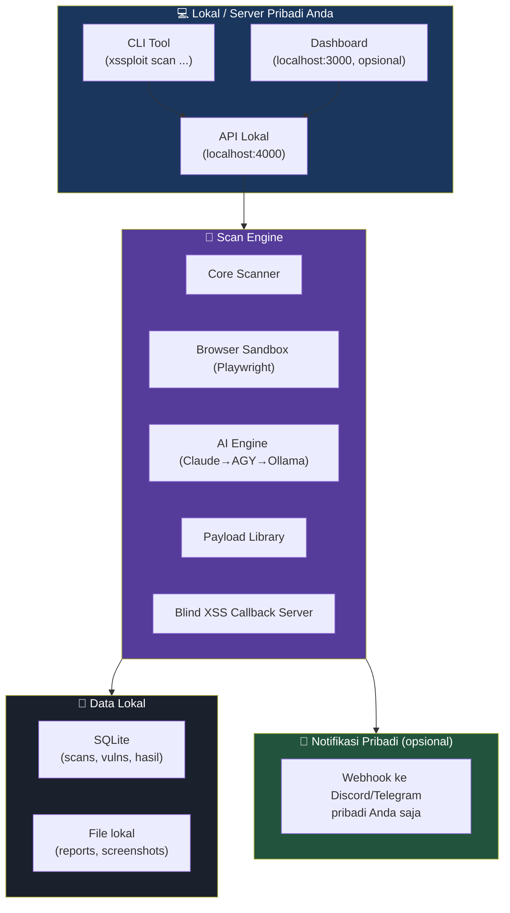

# 🛡️ XSSPLOIT — Blueprint v5: Personal-Use Edition

> Diturunkan dari Blueprint v4 (SaaS Platform). Versi ini untuk **penggunaan pribadi Anda sendiri**, di engagement yang berwenang (kontrak klien Rakarya, program bug bounty dengan scope jelas). Tidak dijual, tidak multi-tenant, tidak didistribusikan ke publik.

---

## Apa yang Berubah dari v4 → v5

| Aspek | v4 (SaaS Publik) | v5 (Personal) |
|---|---|---|
| Pengguna | Multi-tenant, publik | Anda sendiri, single-user |
| Billing | Stripe, 4 tier subscription | Tidak ada — semua fitur langsung aktif |
| Auth | OAuth (Google/GitHub) + JWT multi-user | Tidak perlu, atau token lokal sederhana (opsional) |
| Database | PostgreSQL multi-tenant + Redis cluster | SQLite lokal (atau Postgres single-instance jika mau) |
| Hosting | Cloud (Vercel + container pool + CDN) | Lokal di mesin/server Anda (termasuk GCP server yang sedang disiapkan) |
| Landing page & marketing | Ada | Dihapus total |
| Team management | Ada | Dihapus total |
| Rate limit per-tier, feature-gate | Ada | Dihapus total |
| Scanner engine | Sama | **Sama** — tidak ada fitur teknis yang dikurangi |
| Payload library | Sama | **Sama** |
| Blind XSS callback / webhook | Sama | **Sama**, tapi hanya kirim ke channel pribadi Anda |
| AI provider (Claude → AGY → Ollama) | Sama | **Sama** |

Intinya: **kapabilitas teknis scanner tidak dipotong** — yang dihapus murni lapisan "produk publik" (billing, multi-tenant, marketing, distribusi ke orang lain).

---

## Product Vision

```
CLI Tool + Dashboard Lokal — untuk Anda sendiri
────────────────────────────────────────────────
Single user, local-first
Tidak ada subscription, semua fitur terbuka
Jalan di laptop Anda ATAU di GCP server pribadi (asia-southeast2)
Dashboard tetap ada (kenyamanan visual), tapi bukan produk yang dipasarkan
Data scan tersimpan lokal (SQLite) atau di database pribadi Anda
```



---

## Fitur (Tidak Dikurangi dari v3/v4)

- Reflected / DOM-based / Stored / Blind XSS detection
- Taint tracking (source → sink), mXSS, DOM clobbering detection
- CSP analysis & bypass testing
- Payload library besar (payloads/all-the-things, waf-bypass, context-based, dll.), auto-update dari sumber publik (SecLists, PortSwigger, dll.)
- AI-assisted payload suggestion & context detection (tiered: Claude → Antigravity → Ollama → rule-based)
- Blind XSS callback server + webhook notifikasi (ke channel pribadi Anda)
- PoC demonstration (cookie/session capture) — untuk bukti impact di laporan pentest, dijalankan hanya pada target yang Anda punya otorisasi
- Reconnaissance module (spider, param mining, tech detection, Wayback mining)
- Report generator (PDF, SARIF/JUnit untuk CI/CD pribadi Anda)
- Scan modes: Quick / Deep / Stealth / DOM-only

---

## Struktur Folder (Disederhanakan)

```
xssploit/
├── package.json              → pnpm workspace root
├── pnpm-workspace.yaml
├── turbo.json
├── tsconfig.base.json
├── .env.example               → API keys (Claude/AGY), tidak ada Stripe keys
├── .gitignore                 → node_modules, dist, .env, data/*, reports/output/*
├── docker-compose.yaml        → hanya SQLite volume mount / opsional Postgres single-instance
├── Makefile
├── LICENSE                    → private/proprietary, bukan untuk distribusi
├── AUTHORIZATION_LOG.md        → catatan scope & bukti otorisasi tiap target yang di-scan (rekomendasi, bukan wajib teknis)
└── README.md
│
├── packages/
│   ├── shared/                        # types, constants, utils (sama seperti v4, tanpa subscription.ts)
│   │   └── src/
│   │       ├── types/
│   │       │   ├── scan.ts
│   │       │   ├── vulnerability.ts
│   │       │   ├── payload.ts
│   │       │   └── webhook.ts
│   │       ├── constants/
│   │       │   ├── xss-types.ts
│   │       │   └── scan-profiles.ts
│   │       └── utils/
│   │           ├── validators.ts
│   │           └── formatters.ts
│   │
│   ├── engine/                        # === SAMA PERSIS DENGAN v3/v4 ===
│   │   └── src/
│   │       ├── core/
│   │       │   ├── ai/                # orchestrator, provider-manager, providers/*
│   │       │   ├── crawler/           # spider, form-discoverer, param-extractor, dll.
│   │       │   ├── injector/          # injection-engine, payload-loader/mutator, delivery-methods/*
│   │       │   ├── analyzer/          # response-analyzer, csp-analyzer, js-static-analyzer, dll.
│   │       │   ├── exfiltration/      # PoC capture module (cookie/session demo) — dipakai hanya utk target berwenang
│   │       │   └── callback/          # blind XSS callback server
│   │       ├── sandbox/               # Playwright browser sandbox
│   │       └── config/
│   │
│   ├── api/                           # backend API lokal — TANPA billing/org/tier
│   │   └── src/
│   │       ├── routes/
│   │       │   ├── scans.ts
│   │       │   ├── payloads.ts
│   │       │   ├── reports.ts
│   │       │   └── webhooks.ts        # hanya konfigurasi channel notifikasi pribadi
│   │       ├── middleware/
│   │       │   └── auth.ts            # opsional: token lokal sederhana, bukan multi-user JWT
│   │       ├── services/
│   │       │   └── scan-service.ts
│   │       ├── queue/
│   │       │   └── scan-worker.ts
│   │       └── db/
│   │           └── schema.ts          # tabel: scans, vulnerabilities, scan_endpoints, blind_xss_callbacks — TANPA users/orgs/subscriptions
│   │
│   ├── dashboard/                     # Next.js — untuk Anda sendiri, TANPA landing page/pricing/team
│   │   └── src/app/
│   │       ├── page.tsx               # overview
│   │       ├── scans/new/page.tsx     # scan wizard (5 step, sama seperti desain UI)
│   │       ├── scans/[id]/page.tsx    # live scan view + hasil
│   │       ├── payloads/page.tsx
│   │       ├── reports/page.tsx
│   │       └── settings/page.tsx      # config API keys, webhook, dll.
│   │
│   └── python-services/
│       ├── ai_service.py
│       └── fuzzer_service.py
│
├── payloads/                          # sama seperti v3/v4
│   └── (all-the-things, context-based, waf-bypass, blind-xss, dll.)
│
├── infra/
│   ├── docker/
│   │   ├── Dockerfile.engine
│   │   └── Dockerfile.callback
│   └── scripts/
│       ├── setup-dev.sh
│       └── backup-db.sh
│
├── tests/vulnerable-apps/             # target latihan buatan sendiri (bukan target orang lain)
│   ├── basic-reflected.html
│   ├── dom-based.html
│   ├── filtered-input.html
│   ├── csp-protected.html
│   └── stored-xss-server.ts
│
└── docs/
    ├── setup-guide.md
    ├── api-reference.md
    └── authorization-policy.md        # BARU: kebijakan pribadi kapan tool ini boleh dipakai
```

**Dihapus total dari v4:** `marketing/`, `infra/k8s/`, `Dockerfile.dashboard` (versi cloud), `stripe-setup.md`, `saas-architecture.md`, semua kolom `subscriptions`/`org_members`/`api_keys` (kecuali kalau Anda tetap mau API key lokal untuk diri sendiri).

---

## Konfigurasi (.env.example — Personal)

```bash
# AI Providers
ANTHROPIC_API_KEY=
ANTIGRAVITY_API_KEY=
OLLAMA_HOST=http://localhost:11434

# Database (pilih salah satu)
DATABASE_URL=sqlite:///./data/xssploit.db
# atau: DATABASE_URL=postgres://localhost:5432/xssploit   (single-instance, bukan multi-tenant)

# Callback server (blind XSS)
CALLBACK_DOMAIN=localhost:5001
# Kalau di-deploy ke GCP server pribadi, ganti ke subdomain milik Anda sendiri

# Webhook notifikasi PRIBADI (bukan fitur produk)
DISCORD_WEBHOOK_URL=
TELEGRAM_BOT_TOKEN=
TELEGRAM_CHAT_ID=

# TIDAK ADA: STRIPE_SECRET_KEY, NEXTAUTH_*, OAUTH client secrets multi-user
```

---

## AUTHORIZATION_LOG.md (Rekomendasi, Bukan Fitur Teknis)

Praktik baik yang disarankan sebelum menjalankan scan/PoC exfiltration ke target apapun — dicatat manual oleh Anda, di luar sistem:

```markdown
| Tanggal | Target | Program/Klien | Bukti Otorisasi | Scope | Catatan |
|---|---|---|---|---|---|
| 2026-08-XX | app.example.com | Bugcrowd - ExampleCorp | Link program page | *.example.com, exclude /admin | Blind XSS test disetujui |
```

Ini membantu Anda punya jejak legal kalau suatu saat perlu dipertanggungjawabkan — bukan untuk siapa pun selain Anda sendiri.

---

## Run Instructions (Personal)

```bash
# 1. Setup
git clone <private-repo-anda>   # tidak di-push ke GitHub publik
cd xssploit && pnpm install

# 2. Config
cp .env.example .env
# isi ANTHROPIC_API_KEY, dll.

# 3. Jalankan
pnpm dev
# Dashboard: http://localhost:3000 (lokal, tidak exposed ke internet)
# API:       http://localhost:4000

# 4. Download payload library
bash scripts/payload-collector/collect.sh

# 5. Scan (CLI langsung, tanpa dashboard)
xssploit scan https://target-yang-authorized.com --profile deep --program "Nama Program Bug Bounty"
```

---

## Catatan Deployment ke GCP Server

Karena Anda sedang menyiapkan GCP e2-medium (Jakarta) untuk hosting client sites, tool ini **sebaiknya tidak** dijalankan di server produksi yang sama dengan client sites — pisahkan environment (mis. subdomain/port terbatas, firewall ketat, akses hanya dari IP Anda) supaya:
1. Callback server blind XSS tidak tercampur dengan trafik client production.
2. Tidak ada risiko tool scanning ini terekspos ke internet publik secara tidak sengaja.
