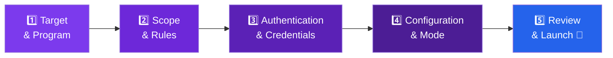
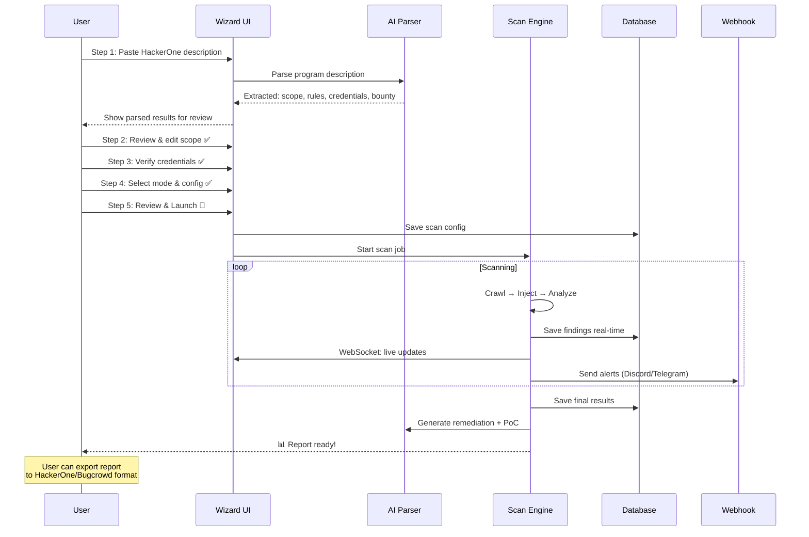

# 🎯 Scan Launcher Wizard — UI Design Detail

> Form input lengkap seperti Penligent AI: paste program description → auto-parse scope → isi credentials → pilih mode → launch

## Preview UI Mockup


---

## Wizard Flow: 5 Steps



---

## Step 1: Target & Program Info

> User paste deskripsi program dari HackerOne/Bugcrowd → AI otomatis parse scope, rules, dan batasan.

```
┌─────────────────────────────────────────────────────────────────────┐
│  🎯 New Scan                    Step 1 of 5: Target & Program      │
│                                 [●━━━━━━━━━━━━━━━━━━━━━━━━━━━━━━━] │
├─────────────────────────────────────────────────────────────────────┤
│                                                                      │
│  Platform                                                            │
│  ┌────────────┐ ┌────────────┐ ┌────────────┐ ┌────────────┐       │
│  │ 🟢 H1     │ │ 🟠 BC      │ │ 🔵 Intgrti │ │ ⚙️ Custom  │       │
│  │ HackerOne  │ │ Bugcrowd   │ │ Intigriti  │ │ Manual     │       │
│  └────────────┘ └────────────┘ └────────────┘ └────────────┘       │
│                                                                      │
│  Program Description                                    [📋 Paste]  │
│  ┌──────────────────────────────────────────────────────────────┐   │
│  │ Paste your HackerOne / Bugcrowd program description here... │   │
│  │                                                              │   │
│  │ Example: Copy the entire "Policy" or "Scope" section from   │   │
│  │ the bug bounty program page and paste it here. Our AI will  │   │
│  │ automatically parse the scope, rules, and boundaries.       │   │
│  │                                                              │   │
│  │                                                              │   │
│  │                                                              │   │
│  └──────────────────────────────────────────────────────────────┘   │
│                                                                      │
│  ── atau isi manual ──────────────────────────────────────────────   │
│                                                                      │
│  Program Name                                                        │
│  ┌──────────────────────────────────────────────────────────────┐   │
│  │ Acme Corp Bug Bounty Program                                 │   │
│  └──────────────────────────────────────────────────────────────┘   │
│                                                                      │
│  Target URL(s)                                          [+ Add URL]  │
│  ┌──────────────────────────────────────────────────────────────┐   │
│  │ https://www.acme.com                                         │   │
│  └──────────────────────────────────────────────────────────────┘   │
│  ┌──────────────────────────────────────────────────────────────┐   │
│  │ https://api.acme.com                                         │   │
│  └──────────────────────────────────────────────────────────────┘   │
│                                                                      │
│  Program URL (opsional)                                              │
│  ┌──────────────────────────────────────────────────────────────┐   │
│  │ https://hackerone.com/acme-corp                               │   │
│  └──────────────────────────────────────────────────────────────┘   │
│                                                                      │
│                                          [← Back]  [Next Step →]    │
└─────────────────────────────────────────────────────────────────────┘
```

### Contoh: User Paste Program Description dari HackerOne

User paste teks ini ke dalam textarea:

```
PROGRAM SCOPE

In Scope:
- *.acme.com (Web Application)
- api.acme.com (API) 
- mobile.acme.com (Mobile Web)
- staging.acme.com (Staging - use test credentials provided)

Out of Scope:
- blog.acme.com (WordPress - third party)
- status.acme.com (Statuspage - third party)
- *.acme.internal (Internal network)
- Any physical attacks
- Social engineering
- DoS/DDoS attacks

Vulnerability Types Accepted:
- Cross-Site Scripting (XSS) - Reflected, Stored, DOM-based
- Server-Side Request Forgery (SSRF)
- SQL Injection
- Authentication Bypass
- IDOR

Bounty Ranges:
- Critical: $5,000 - $15,000
- High: $2,000 - $5,000
- Medium: $500 - $2,000
- Low: $100 - $500

Rules:
- Do not test on production accounts belonging to other users
- Do not perform destructive actions (delete, modify user data)
- Rate limit your requests to 50 req/sec max
- Report vulnerabilities within 24 hours of discovery
- Use your own test accounts only

Test Credentials:
- Username: testuser@acme.com
- Password: BugBounty2026!
- API Key: sk_test_abc123xyz
```

### AI Auto-Parse Result

Setelah paste, AI otomatis memproses dan menampilkan:

```
┌─────────────────────────────────────────────────────────────────────┐
│  🤖 AI Parsed Results                              [✏️ Edit]       │
├─────────────────────────────────────────────────────────────────────┤
│                                                                      │
│  ✅ Successfully parsed! Found 8 items.                              │
│                                                                      │
│  🟢 In Scope (auto-detected):                                       │
│  ┌──────────────────────────────────────────────────────────────┐   │
│  │ ✅ *.acme.com              │ Web Application                 │   │
│  │ ✅ api.acme.com            │ API                              │   │
│  │ ✅ mobile.acme.com         │ Mobile Web                       │   │
│  │ ✅ staging.acme.com        │ Staging (test credentials)       │   │
│  └──────────────────────────────────────────────────────────────┘   │
│                                                                      │
│  🔴 Out of Scope (auto-detected):                                   │
│  ┌──────────────────────────────────────────────────────────────┐   │
│  │ ❌ blog.acme.com           │ Third party (WordPress)          │   │
│  │ ❌ status.acme.com         │ Third party (Statuspage)         │   │
│  │ ❌ *.acme.internal         │ Internal network                 │   │
│  └──────────────────────────────────────────────────────────────┘   │
│                                                                      │
│  🔑 Credentials Detected:                                           │
│  ┌──────────────────────────────────────────────────────────────┐   │
│  │ 👤 Username: testuser@acme.com                                │   │
│  │ 🔒 Password: ••••••••••••••                    [👁️ Show]     │   │
│  │ 🔑 API Key:  sk_test_•••••••                   [👁️ Show]     │   │
│  └──────────────────────────────────────────────────────────────┘   │
│                                                                      │
│  ⚠️ Rules Detected:                                                 │
│  ┌──────────────────────────────────────────────────────────────┐   │
│  │ ⚡ Rate limit: 50 req/sec                                     │   │
│  │ 🚫 No destructive actions                                     │   │
│  │ 🚫 No testing other user accounts                             │   │
│  │ 🚫 No DoS/DDoS                                                │   │
│  └──────────────────────────────────────────────────────────────┘   │
│                                                                      │
│  💰 Bounty Ranges:                                                   │
│  ┌──────────────────────────────────────────────────────────────┐   │
│  │ 🔴 Critical: $5,000 - $15,000                                 │   │
│  │ 🟡 High:     $2,000 - $5,000                                  │   │
│  │ 🟠 Medium:   $500 - $2,000                                    │   │
│  │ 🟢 Low:      $100 - $500                                      │   │
│  └──────────────────────────────────────────────────────────────┘   │
│                                                                      │
│  💡 AI Recommendation:                                               │
│  ┌──────────────────────────────────────────────────────────────┐   │
│  │ "Program ini menerima XSS — perfect fit untuk scanner kita.  │   │
│  │  Saya sarankan Deep Scan pada *.acme.com dan api.acme.com    │   │
│  │  dengan rate limit 50 req/sec. Credentials sudah terdeteksi  │   │
│  │  dan akan digunakan untuk authenticated scanning."            │   │
│  └──────────────────────────────────────────────────────────────┘   │
│                                                                      │
└─────────────────────────────────────────────────────────────────────┘
```

---

## Step 2: Scope & Rules

> Review dan edit scope yang sudah di-parse AI. Tambah/hapus domain, set batasan.

```
┌─────────────────────────────────────────────────────────────────────┐
│  🎯 New Scan                    Step 2 of 5: Scope & Rules         │
│                                 [●●●●━━━━━━━━━━━━━━━━━━━━━━━━━━━━] │
├─────────────────────────────────────────────────────────────────────┤
│                                                                      │
│  ═══ IN SCOPE ══════════════════════════════════════════ [+ Add]     │
│                                                                      │
│  ┌──────────────────┬──────────┬──────────┬──────────┬───────────┐ │
│  │ Domain/URL       │ Type     │ Priority │ Auth     │ Actions   │ │
│  ├──────────────────┼──────────┼──────────┼──────────┼───────────┤ │
│  │ *.acme.com       │ Web App  │ ⭐ High  │ Cookie   │ [✏️] [🗑️]│ │
│  │ api.acme.com     │ API      │ ⭐ High  │ API Key  │ [✏️] [🗑️]│ │
│  │ mobile.acme.com  │ Mobile   │ 🔸 Med   │ Cookie   │ [✏️] [🗑️]│ │
│  │ staging.acme.com │ Staging  │ 🔸 Med   │ Form     │ [✏️] [🗑️]│ │
│  └──────────────────┴──────────┴──────────┴──────────┴───────────┘ │
│                                                                      │
│  ═══ OUT OF SCOPE ═══════════════════════════════════════ [+ Add]   │
│                                                                      │
│  ┌──────────────────────────────────────────────────────────────┐   │
│  │ ❌ blog.acme.com          [🗑️]                               │   │
│  │ ❌ status.acme.com        [🗑️]                               │   │
│  │ ❌ *.acme.internal        [🗑️]                               │   │
│  │ ❌ /logout                [🗑️]                               │   │
│  │ ❌ /admin/delete*         [🗑️]                               │   │
│  └──────────────────────────────────────────────────────────────┘   │
│                                                                      │
│  ═══ VULNERABILITY FOCUS ═══════════════════════════════════════    │
│                                                                      │
│  Scan for these XSS types:                                           │
│  ☑ Reflected XSS          ☑ Stored XSS            ☑ DOM-based XSS  │
│  ☑ Blind XSS              ☐ mXSS (Mutation)       ☐ DOM Clobbering │
│  ☐ Self-XSS               ☑ Template Injection                      │
│                                                                      │
│  ═══ CRAWL LIMITS ═══════════════════════════════════════════════   │
│                                                                      │
│  Max Crawl Depth         Max Pages              Max Scan Time        │
│  ┌──────────────┐       ┌──────────────┐       ┌──────────────┐     │
│  │ 5            │       │ 500          │       │ 2 hours      │     │
│  └──────────────┘       └──────────────┘       └──────────────┘     │
│                                                                      │
│  ═══ RULES OF ENGAGEMENT ═══════════════════════════════════════    │
│                                                                      │
│  Rate Limit                                                          │
│  ┌──────────────────────────────────────────────────────────────┐   │
│  │ ⚡ 50 requests/second (from program rules)                   │   │
│  │ [slider: ████████████████████░░░░░░░░░░ 50 req/s]            │   │
│  └──────────────────────────────────────────────────────────────┘   │
│                                                                      │
│  Safety Rules (auto-enforced):                                       │
│  ☑ No destructive actions (DELETE/PUT disabled)                      │
│  ☑ No testing other user accounts                                    │
│  ☑ Respect robots.txt → ☐ (override: security testing)              │
│  ☑ Log all actions for responsible disclosure                        │
│                                                                      │
│                                          [← Back]  [Next Step →]    │
└─────────────────────────────────────────────────────────────────────┘
```

---

## Step 3: Authentication & Credentials

> Isi login details, session tokens, cookies, API keys — support multi-role testing.

```
┌─────────────────────────────────────────────────────────────────────┐
│  🎯 New Scan                  Step 3 of 5: Authentication          │
│                               [●●●●●●●●━━━━━━━━━━━━━━━━━━━━━━━━━━] │
├─────────────────────────────────────────────────────────────────────┤
│                                                                      │
│  Authentication Method                                               │
│  ┌──────────┐ ┌──────────┐ ┌──────────┐ ┌──────────┐ ┌──────────┐ │
│  │ 🚫 None  │ │ 🍪 Cookie│ │ 🔑 Token │ │ 👤 Login │ │ 🌐 OAuth │ │
│  └──────────┘ └──────────┘ └──────────┘ └──────────┘ └──────────┘ │
│  ┌──────────┐                                                       │
│  │ 🎥 Record│  ← Record browser login session                      │
│  └──────────┘                                                       │
│                                                                      │
│  ════════════════════════════════════════════════════════════════    │
│  Selected: 👤 Form Login                                            │
│  ════════════════════════════════════════════════════════════════    │
│                                                                      │
│  Login URL                                                           │
│  ┌──────────────────────────────────────────────────────────────┐   │
│  │ https://www.acme.com/login                                    │   │
│  └──────────────────────────────────────────────────────────────┘   │
│                                                                      │
│  ┌─────────────── Role 1: Regular User ───────────────────────┐    │
│  │                                                              │    │
│  │  Username / Email                                            │    │
│  │  ┌──────────────────────────────────────────────────────┐   │    │
│  │  │ testuser@acme.com                                     │   │    │
│  │  └──────────────────────────────────────────────────────┘   │    │
│  │                                                              │    │
│  │  Password                                                    │    │
│  │  ┌──────────────────────────────────────────────┐ [👁️ Show]│    │
│  │  │ ••••••••••••••                                │          │    │
│  │  └──────────────────────────────────────────────┘          │    │
│  │                                                              │    │
│  │  Username Field Selector (CSS)     Password Field Selector   │    │
│  │  ┌─────────────────────────┐      ┌─────────────────────┐  │    │
│  │  │ #email / input[name=usr]│      │ #password            │  │    │
│  │  └─────────────────────────┘      └─────────────────────┘  │    │
│  │                                                              │    │
│  │  Submit Button Selector            2FA / CAPTCHA             │    │
│  │  ┌─────────────────────────┐      ┌─────────────────────┐  │    │
│  │  │ button[type=submit]     │      │ ○ None  ○ OTP  ○ Cap│  │    │
│  │  └─────────────────────────┘      └─────────────────────┘  │    │
│  │                                                              │    │
│  └──────────────────────────────────────────────────────────────┘   │
│                                                                      │
│  [+ Add Another Role]  ← Test XSS across different permission levels│
│                                                                      │
│  ┌─────────── Role 2: Admin User (opsional) ──────────────────┐    │
│  │  Username: admin@acme.com    Password: ••••••••    [🗑️ Del]│    │
│  └──────────────────────────────────────────────────────────────┘   │
│                                                                      │
│  ═══ ADDITIONAL CREDENTIALS ════════════════════════════════════    │
│                                                                      │
│  API Keys                                              [+ Add Key]  │
│  ┌──────────────────────────────────────────────────────────────┐   │
│  │ Header Name          │ Key Value                              │   │
│  │ ┌──────────────────┐ │ ┌──────────────────────────┐ [👁️]    │   │
│  │ │ X-API-Key         │ │ │ sk_test_abc123xyz        │          │   │
│  │ └──────────────────┘ │ └──────────────────────────┘          │   │
│  └──────────────────────────────────────────────────────────────┘   │
│                                                                      │
│  Custom Cookies                                        [+ Add]      │
│  ┌──────────────────────────────────────────────────────────────┐   │
│  │ Name                 │ Value                                   │   │
│  │ ┌──────────────────┐ │ ┌──────────────────────────┐          │   │
│  │ │ session           │ │ │ abc123def456...           │          │   │
│  │ └──────────────────┘ │ └──────────────────────────┘          │   │
│  └──────────────────────────────────────────────────────────────┘   │
│                                                                      │
│  Custom Headers                                        [+ Add]      │
│  ┌──────────────────────────────────────────────────────────────┐   │
│  │ Header               │ Value                                   │   │
│  │ ┌──────────────────┐ │ ┌──────────────────────────┐          │   │
│  │ │ Authorization     │ │ │ Bearer eyJhbG...          │          │   │
│  │ └──────────────────┘ │ └──────────────────────────┘          │   │
│  └──────────────────────────────────────────────────────────────┘   │
│                                                                      │
│  [🧪 Test Login] ← Verify credentials work before scanning         │
│  ✅ Login successful! Session cookie captured.                       │
│                                                                      │
│                                          [← Back]  [Next Step →]    │
└─────────────────────────────────────────────────────────────────────┘
```

---

## Step 4: Configuration & Mode

> Pilih scan mode, proxy, payload categories, webhook, dan advanced options.

```
┌─────────────────────────────────────────────────────────────────────┐
│  🎯 New Scan                Step 4 of 5: Configuration              │
│                             [●●●●●●●●●●●●━━━━━━━━━━━━━━━━━━━━━━━━] │
├─────────────────────────────────────────────────────────────────────┤
│                                                                      │
│  ═══ SCAN MODE ═════════════════════════════════════════════════    │
│                                                                      │
│  ┌───────────────┐ ┌───────────────┐ ┌───────────────┐             │
│  │  ⚡ Quick     │ │  🔬 Deep      │ │  🕵️ Stealth  │             │
│  │  Scan         │ │  Scan         │ │  Scan         │             │
│  │               │ │  ████████     │ │               │             │
│  │ ~5 min        │ │  ~30 min      │ │ ~60 min       │             │
│  │ 5K payloads   │ │  All payloads │ │ All + evasion │             │
│  │ Basic DOM     │ │  Deep JS      │ │ Deep JS + Tor │             │
│  │ No auth req   │ │  Full taint   │ │ Anti-detect   │             │
│  └───────────────┘ └───────────────┘ └───────────────┘             │
│                                                                      │
│  ┌───────────────┐ ┌───────────────┐ ┌───────────────┐             │
│  │  🎯 DOM Only  │ │  📡 Blind XSS │ │  🔌 API Only  │             │
│  │               │ │               │ │               │             │
│  │ ~15 min       │ │  ~20 min      │ │ ~10 min       │             │
│  │ DOM payloads  │ │  Callback srv │ │ REST/GraphQL  │             │
│  │ Source→Sink   │ │  Stored focus │ │ JSON/XML XSS  │             │
│  │ SPA focused   │ │  Delayed exec │ │ Header inject │             │
│  └───────────────┘ └───────────────┘ └───────────────┘             │
│                                                                      │
│  ═══ PAYLOAD SELECTION ════════════════════════════════ [Advanced]  │
│                                                                      │
│  Preset: [All Payloads ▾]                                            │
│                                                                      │
│  Categories:                                                         │
│  ☑ PayloadsAllTheThings    ☑ SecLists        ☑ FuzzDB               │
│  ☑ PortSwigger            ☑ Framework-spec   ☑ WAF Bypass            │
│  ☑ Context-based          ☑ Encoding vars    ☑ Polyglot              │
│  ☐ AI-Generated (on-the-fly)  ← PRO only                            │
│  ☑ Custom Payloads                                                    │
│                                                                      │
│  Total payloads selected: 85,920                                     │
│                                                                      │
│  ═══ NETWORK & STEALTH ════════════════════════════════════════     │
│                                                                      │
│  Proxy                                                               │
│  ┌────────────┐ ┌────────────┐ ┌────────────┐ ┌────────────┐       │
│  │ 🚫 None    │ │ 🔀 Custom  │ │ 🧅 Tor     │ │ 🔗 Chain   │       │
│  └────────────┘ └────────────┘ └────────────┘ └────────────┘       │
│                                                                      │
│  Proxy Chain (kalau Custom/Chain dipilih):                           │
│  ┌──────────────────────────────────────────────────────────────┐   │
│  │ socks5://127.0.0.1:9050 → http://proxy2:8080               │   │
│  └──────────────────────────────────────────────────────────────┘   │
│                                                                      │
│  User-Agent        ┌──────────────────────────────────────────┐     │
│  ○ Default         │                                          │     │
│  ● Random Rotate   │ Rotate among 500+ real User-Agents      │     │
│  ○ Custom          │                                          │     │
│                    └──────────────────────────────────────────┘     │
│                                                                      │
│  ☑ Enable browser fingerprint randomization                         │
│  ☑ Add random delays between requests (anti-ban)                    │
│  ☐ Route through Tor (changes circuit every 10 requests)            │
│                                                                      │
│  ═══ BLIND XSS CALLBACK ══════════════════════════════════════     │
│                                                                      │
│  ☑ Enable Blind XSS callback server                                 │
│  Callback URL: https://cb.xssploit.io/c/usr_abc123  [📋 Copy]      │
│  ☑ Auto-inject callback payloads in forms, comments, tickets        │
│                                                                      │
│  ═══ NOTIFICATIONS ═══════════════════════════════════════════      │
│                                                                      │
│  Notify me when:                                                     │
│  ☑ XSS vulnerability found (Critical/High)                          │
│  ☑ Blind XSS triggered                                              │
│  ☑ Scan completed                                                    │
│  ☐ Every finding (including Medium/Low)                              │
│                                                                      │
│  Notify via:                                                         │
│  ☑ Dashboard notification                                            │
│  ☑ Discord webhook      URL: ┌──────────────────────────────────┐  │
│  ☐ Telegram bot               │ https://discord.com/api/webhooks │  │
│  ☐ Slack webhook               └──────────────────────────────────┘  │
│  ☑ Email (testuser@gmail.com)                                        │
│                                                                      │
│  ═══ AI ENGINE ═══════════════════════════════════════════════      │
│                                                                      │
│  AI Provider:                                                        │
│  ┌────────────┐ ┌────────────┐ ┌────────────┐ ┌────────────┐       │
│  │ 🟣 Claude  │ │ 🔵 Antigra │ │ 🟢 Ollama  │ │ 🔴 No AI   │       │
│  │  (auto)    │ │  vity      │ │  (local)   │ │ Rules only │       │
│  └────────────┘ └────────────┘ └────────────┘ └────────────┘       │
│                                                                      │
│  AI Budget for this scan:                                            │
│  [slider: ██████████████░░░░░░░░░░░░░░ 25,000 tokens]               │
│  Estimated cost: ~$0.15 | Remaining monthly: 75,000 tokens          │
│                                                                      │
│  AI Features:                                                        │
│  ☑ Smart payload selection (context-aware)                           │
│  ☑ Adaptive WAF bypass                                               │
│  ☑ False positive reduction                                          │
│  ☑ Auto-generate remediation suggestions                             │
│  ☐ AI payload fuzzing (generate new payloads on-the-fly)             │
│                                                                      │
│                                          [← Back]  [Next Step →]    │
└─────────────────────────────────────────────────────────────────────┘
```

---

## Step 5: Review & Launch

> Review semua konfigurasi sebelum launch. Estimasi waktu dan biaya.

```
┌─────────────────────────────────────────────────────────────────────┐
│  🎯 New Scan               Step 5 of 5: Review & Launch 🚀        │
│                             [●●●●●●●●●●●●●●●●●●●●●●●●●●●●●●●●●●●] │
├─────────────────────────────────────────────────────────────────────┤
│                                                                      │
│  ┌── 📋 SCAN SUMMARY ──────────────────────────────────────────┐   │
│  │                                                              │   │
│  │  Program:    Acme Corp Bug Bounty Program                    │   │
│  │  Platform:   HackerOne                                       │   │
│  │  Mode:       🔬 Deep Scan                                    │   │
│  │                                                              │   │
│  │  ─── Targets ───                                             │   │
│  │  • https://www.acme.com (Web App)                            │   │
│  │  • https://api.acme.com (API)                                │   │
│  │  • https://mobile.acme.com (Mobile)                          │   │
│  │  • https://staging.acme.com (Staging)                        │   │
│  │                                                              │   │
│  │  ─── Scope ───                                               │   │
│  │  In scope:   4 domains                                       │   │
│  │  Excluded:   3 domains + 2 paths                             │   │
│  │  XSS types:  Reflected, Stored, DOM, Blind, Template         │   │
│  │  Max depth:  5 | Max pages: 500 | Time limit: 2 hours       │   │
│  │                                                              │   │
│  │  ─── Authentication ───                                      │   │
│  │  Method:     Form Login (2 roles)                            │   │
│  │  Role 1:     testuser@acme.com (Regular User) ✅ Verified    │   │
│  │  Role 2:     admin@acme.com (Admin) ✅ Verified              │   │
│  │  API Key:    X-API-Key: sk_test_••• ✅ Verified              │   │
│  │                                                              │   │
│  │  ─── Configuration ───                                       │   │
│  │  Payloads:   85,920 (all categories)                         │   │
│  │  Proxy:      None                                            │   │
│  │  User-Agent: Random rotation (500+ UAs)                      │   │
│  │  Rate limit: 50 req/sec                                      │   │
│  │  Blind XSS:  Enabled (cb.xssploit.io/c/usr_abc123)         │   │
│  │                                                              │   │
│  │  ─── AI ───                                                  │   │
│  │  Provider:   Claude (auto-fallback to Antigravity)           │   │
│  │  Budget:     25,000 tokens                                   │   │
│  │  Features:   Smart select, WAF bypass, FP reduction          │   │
│  │                                                              │   │
│  │  ─── Notifications ───                                       │   │
│  │  Discord:    ✅ Connected                                     │   │
│  │  Email:      testuser@gmail.com                              │   │
│  │                                                              │   │
│  │  ─── Safety Rules ───                                        │   │
│  │  ✅ No destructive actions                                   │   │
│  │  ✅ Rate limited to 50 req/sec                               │   │
│  │  ✅ All actions logged                                       │   │
│  │                                                              │   │
│  └──────────────────────────────────────────────────────────────┘   │
│                                                                      │
│  ┌── 📊 ESTIMATES ─────────────────────────────────────────────┐   │
│  │                                                              │   │
│  │  ⏱️ Estimated Duration:     25 - 40 minutes                  │   │
│  │  🤖 AI Token Usage:         ~15,000 - 25,000 tokens          │   │
│  │  📡 Requests:               ~50,000 - 120,000 requests       │   │
│  │  💾 Storage:                ~50 - 200 MB (screenshots, HAR)  │   │
│  │                                                              │   │
│  │  Monthly Usage After Scan:                                   │   │
│  │  Scans:    19/50 used         AI: ~90K/100K remaining        │   │
│  │                                                              │   │
│  └──────────────────────────────────────────────────────────────┘   │
│                                                                      │
│  ┌──────────────────────────────────────────────────────────────┐   │
│  │                                                              │   │
│  │   [📄 Save as Template]    [📋 Export Config JSON]           │   │
│  │                                                              │   │
│  │             ┌─────────────────────────────┐                  │   │
│  │             │                             │                  │   │
│  │             │   🚀 LAUNCH SCAN            │                  │   │
│  │             │                             │                  │   │
│  │             └─────────────────────────────┘                  │   │
│  │                                                              │   │
│  │   ☑ I confirm this is an authorized security test            │   │
│  │                                                              │   │
│  └──────────────────────────────────────────────────────────────┘   │
│                                                                      │
│                                          [← Back]                    │
└─────────────────────────────────────────────────────────────────────┘
```

---

## Setelah Launch — Live Scan Dashboard

```
┌─────────────────────────────────────────────────────────────────────┐
│  🔄 SCANNING: Acme Corp         [⏸ Pause] [⏹ Stop] [📋 Details]   │
├─────────────────────────────────────────────────────────────────────┤
│                                                                      │
│  ████████████████████████░░░░░░░░░░ 68%         ETA: 12m 34s       │
│                                                                      │
│  ┌──────────┐ ┌──────────┐ ┌──────────┐ ┌──────────┐ ┌──────────┐ │
│  │ 📍 47/76 │ │ 💣 42.1K │ │ ⚡ 48/s  │ │ 🔴 3     │ │ 🟡 7     │ │
│  │Endpoints │ │ Payloads │ │ Req/sec  │ │Critical  │ │ High     │ │
│  └──────────┘ └──────────┘ └──────────┘ └──────────┘ └──────────┘ │
│                                                                      │
│  ┌──── LIVE FEED ───────────────────────────────────────────────┐  │
│  │ 21:30:15  🔍 /search?q= (html-context) → Testing 47/85920   │  │
│  │ 21:30:15  🛡️ WAF Detected: Cloudflare                       │  │
│  │ 21:30:16  🤖 AI: Switching to cloudflare-bypass payloads     │  │
│  │ 21:30:17  🔴 XSS FOUND! /profile?name= (Reflected)          │  │
│  │           Payload:               │  │
│  │           Impact: Cookie theft possible                       │  │
│  │           📸 Screenshot captured | 📡 Discord notified       │  │
│  │ 21:30:18  🔍 /api/v2/users?search= (json-context)           │  │
│  │ 21:30:19  🟡 Potential DOM XSS: location.hash → innerHTML    │  │
│  │           Taint flow detected, confirming...                  │  │
│  │ 21:30:20  🤖 AI: Generating targeted payload for DOM sink    │  │
│  └──────────────────────────────────────────────────────────────┘  │
│                                                                      │
│  ┌──── FINDINGS ────────────────────────────────────────────────┐  │
│  │ #  │ Type      │ URL              │ Severity │ Status       │  │
│  │ 1  │ Reflected │ /search?q=       │ 🔴 Crit  │ Confirmed   │  │
│  │ 2  │ Reflected │ /profile?name=   │ 🔴 Crit  │ Confirmed   │  │
│  │ 3  │ DOM-based │ /app#section=    │ 🔴 Crit  │ Confirmed   │  │
│  │ 4  │ Stored    │ /comments (POST) │ 🟡 High  │ Confirmed   │  │
│  │ 5  │ DOM-based │ /dashboard       │ 🟡 High  │ Verifying   │  │
│  │ ...│           │                  │          │             │  │
│  └──────────────────────────────────────────────────────────────┘  │
│                                                                      │
│  ┌──── AI INSIGHTS ─────────────────────────────────────────────┐  │
│  │ 🤖 "Target menggunakan Cloudflare WAF + React frontend.      │  │
│  │     Saya sudah adaptasi strategy: fokus DOM XSS pada React   │  │
│  │     components dan bypass Cloudflare via unicode encoding.    │  │
│  │     3 critical XSS ditemukan sejauh ini — 2 bisa steal       │  │
│  │     cookies, 1 DOM-based bisa hijack session."                │  │
│  └──────────────────────────────────────────────────────────────┘  │
└─────────────────────────────────────────────────────────────────────┘
```

---

## Scan History View

```
┌─────────────────────────────────────────────────────────────────────┐
│  📋 Scan History                          [🔍 Search] [📥 Export]  │
├─────────────────────────────────────────────────────────────────────┤
│                                                                      │
│  Filters: [All Status ▾] [All Severity ▾] [Date Range ▾] [Sort ▾] │
│                                                                      │
│  ┌──────────────────────────────────────────────────────────────┐   │
│  │ 🟢 Acme Corp Bug Bounty                                      │   │
│  │ https://www.acme.com        Deep Scan    7 Aug 2026, 21:30   │   │
│  │ ✅ Completed in 38 min      🔴 3 Crit  🟡 7 High  🟠 12 Med │   │
│  │ Bounty estimate: $8,500 - $23,000      [View] [Re-scan] [📊]│   │
│  ├──────────────────────────────────────────────────────────────┤   │
│  │ 🟢 Example Corp                                               │   │
│  │ https://app.example.com     Quick Scan   6 Aug 2026, 14:15   │   │
│  │ ✅ Completed in 5 min       🟡 1 High   🟠 3 Med             │   │
│  │ Bounty estimate: $2,000 - $5,000       [View] [Re-scan] [📊]│   │
│  ├──────────────────────────────────────────────────────────────┤   │
│  │ 🔵 Internal App (staging)                                     │   │
│  │ https://staging.internal.io  Stealth     5 Aug 2026, 09:00   │   │
│  │ ⏸ Paused at 45%             🟠 2 Med                         │   │
│  │                                         [Resume] [View] [🗑️]│   │
│  ├──────────────────────────────────────────────────────────────┤   │
│  │ 📡 Blind XSS — Waiting for callback                          │   │
│  │ https://support.target.com   Blind XSS   4 Aug 2026, 11:00  │   │
│  │ 📡 3 payloads injected, 0 triggered     [Monitor] [View]    │   │
│  └──────────────────────────────────────────────────────────────┘   │
│                                                                      │
│  Showing 1-4 of 23 scans                  [← Prev] [1] [2] [→]    │
└─────────────────────────────────────────────────────────────────────┘
```

---

## Data Flow: Dari Paste Description → Report


